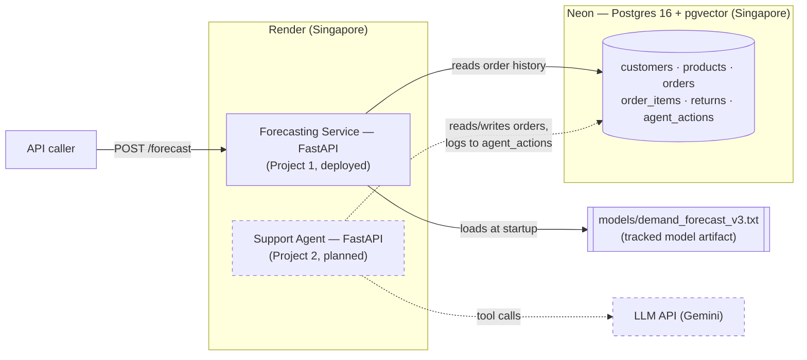

# Demand Forecasting Service

[](https://github.com/ganesan-rengan/retail-intelligence/actions/workflows/ci.yml)

Weekly demand forecasts for retail SKUs, served over a small FastAPI app backed
by a LightGBM model and a shared Postgres database. Part of the
`retail-intelligence` monorepo — see [Architecture](#architecture) for how
this fits alongside the planned support agent.

## Live service

- **API base:** https://retail-forecasting-service.onrender.com
- **Interactive docs:** https://retail-forecasting-service.onrender.com/docs

This runs on Render's free tier, which spins the container down after a
period of inactivity. The first request after an idle period can take
**up to ~50 seconds** to respond while it cold-starts; every request after
that is normal latency until it idles out again.

## Try it

```bash
curl -X POST https://retail-forecasting-service.onrender.com/forecast \
  -H "Content-Type: application/json" \
  -d '{"product_id": "85123A"}'
```

```json
{"product_id":"85123A","predicted_units":772.7232296801847,"week_start":"2011-12-26","week_end":"2012-01-01","model_version":"v3","horizon_days":28,"generated_at":"2026-09-15T04:04:13.819866Z"}
```

`predicted_units` and `generated_at` will vary per request and per model
version. `week_start`/`week_end` anchor to the latest complete week in the
underlying dataset, not to the actual current date — the dataset is
historical (2009-2011), so forecasts are for weeks in that period.

## Architecture

Two services share one Postgres database — the two-projects-one-database
design is deliberate from the start, not something bolted on later.



The `agent_actions` table and the `pgvector` extension are already
provisioned in the schema for the support agent's tool-call logging and
retrieval — reserved, not yet used by anything.

## Deployment pipeline

```
Docker build  -->  Render (Singapore)  -->  Neon Postgres (Singapore)
```

- `forecasting_service/Dockerfile` is a two-stage build: a `uv`-based builder
  stage installs locked dependencies before any application code is copied
  in, so a code-only change never invalidates the dependency layer; the
  runtime stage adds `libgomp1` (LightGBM's OpenMP dependency) and runs as a
  non-root user.
- `render.yaml` builds that Dockerfile directly on Render (`runtime: docker`,
  `dockerContext: .`) on the free plan, in the **Singapore** region, with
  `/health` as the platform health check.
- The database is **Neon**, also hosted in Singapore, to keep the
  service-to-database hop within one region. `DATABASE_URL` is injected as a
  Render environment secret (`sync: false` in `render.yaml`) — never
  committed, never read from a local `.env` in production.

## API

| Method | Path | Description |
|---|---|---|
| `GET` | `/health` | Readiness check. Returns 503 if the model isn't loaded or the database isn't reachable. |
| `POST` | `/forecast` | Predict units for one trained `product_id` over the fixed 4-week horizon. 404 if the product wasn't in the training set. |
| `GET` | `/model-info` | Metadata about the currently loaded model: version, training time, algorithm, feature count, baseline comparison. |
| `GET` | `/products` | The list of `product_id`s the current model can forecast. |

Full request/response schemas, including validation rules, are in the
interactive docs at [`/docs`](https://retail-forecasting-service.onrender.com/docs).

## Results

Full metrics, the baseline comparison, and the methodology notes live in
[`docs/results.md`](docs/results.md) — generated by
`scripts/generate_results_table.py` directly from the pipeline's own
persisted output, not hand-written. **WAPE is the metric to trust; MAPE is
reported for reference only** (see the limitations note in that file for why).

## Engineering decisions

Short version of the calls that shaped this project. Longer writeups exist
as ADRs where noted.

- **Forecast scope and which baseline has to be beaten** — decided in
  advance from the baseline sweep, not picked after seeing the model's
  numbers. [ADR-005](docs/adr/005-forecast-scope-and-baselines.md)
- **Model artifacts are versioned and tracked in git, not just gitignored
  metadata** — closes a rollback gap: a version recorded in history is
  useless if the file it points to no longer exists anywhere.
  [ADR-006](docs/adr/006-model-artifact-versioning-and-rollback.md)
- **Chronological, not random, train/test split** — every leakage guard in
  `forecasting_service/src/split.py` and `demand.py` (product selection,
  feature windows, the internal validation cut) is enforced relative to one
  fixed date boundary, so no split can leak future information into training.
- **WAPE over MAPE as the headline metric** — MAPE blows up on low-volume,
  sparse rows in a way that doesn't track actual forecast usefulness; see
  `scripts/diagnose_mape.py` and the limitations note in
  [`docs/results.md`](docs/results.md).
- **The data loader is resumable per table, not just idempotent** —
  `scripts/load_data.py` commits one table at a time and refuses to guess
  when a table has a row count that doesn't match what's expected, instead
  of silently skipping a partially-loaded table or re-truncating everything
  on every retry.

## Limitations

- Trained and evaluated on a single historical train/test split, not
  repeated cross-validation across multiple periods — see `docs/results.md`
  for what that means for the reported numbers.
- Scoped to the top 50 products by volume (with a few exclusions — see
  `demand.py`); does not generalize to the full catalog.
- Forecast horizon is fixed at 4 weeks; the API rejects any other value
  rather than extrapolating past what the model was trained for.
- Demand in the test period drifted from the training distribution (see
  `docs/results.md`), which argues for scheduled retraining rather than a
  one-time fit.
- Free-tier Render hosting means real-world latency includes occasional cold
  starts (see above) — not representative of a production SLA.
- The support agent (Project 2) doesn't exist yet. The shared-database
  design above is real and enforced by the schema today, but nothing
  currently exercises the `agent_actions` side of it end to end.

## Local setup

Requires Docker and [`uv`](https://docs.astral.sh/uv/). From a fresh clone:

```bash
# 1. Install dependencies
uv sync

# 2. Local config — .env.example ships with working throwaway credentials
#    for the docker-compose Postgres container, so this needs no editing.
cp .env.example .env

# 3. Start Postgres
docker compose up -d postgres

# 4. Create the schema
uv run alembic upgrade head

# 5. Download the dataset (UCI Online Retail II; ~45MB, 1-3 min to convert)
uv run python scripts/download_data.py

# 6. Transform and load it (resumable — safe to rerun; add --truncate for a
#    clean reload)
uv run python scripts/load_data.py

# 7. Run the API
uv run uvicorn forecasting_service.app.main:app --reload
# or, to match the deployed container exactly:
docker compose up --build forecasting-service
```

Verify it's up:

```bash
curl localhost:8000/health
curl -X POST localhost:8000/forecast -H "Content-Type: application/json" \
  -d '{"product_id": "85123A"}'
```

This sequence was verified end to end in a clean clone against an empty
database as part of writing this document.

### Reproducing the results (optional)

`docs/results.md` is generated, not hand-written. To regenerate it from
scratch after step 6 above:

```bash
uv run python forecasting_service/src/demand.py    # build the weekly demand table
uv run python forecasting_service/src/baseline.py  # naive / seasonal / moving-average baselines
uv run python forecasting_service/src/train.py     # fit LightGBM, evaluate on test
uv run python scripts/generate_results_table.py    # regenerate docs/results.md
```

The pipeline is seeded end to end (fixed train/test date boundary, LightGBM
`seed: 42`), so this reproduces `docs/results.md` exactly. Verified by
running this sequence in a clean clone and diffing the output against the
committed file.

## Project structure

```
retail-intelligence/
├── forecasting_service/      # Project 1 — deployed
│   ├── app/                  # FastAPI app: routes, schemas, config, serving logic
│   ├── src/                  # training pipeline: demand, features, split, train, metrics
│   └── Dockerfile
├── support-agent/            # Project 2 — not started
├── shared/                   # SQLAlchemy models + DB session, used by both services
├── scripts/                  # ETL and one-off utilities (download, load, results, diagnostics)
├── migrations/                # Alembic schema migrations
├── data/                      # not tracked — raw/processed data, created by scripts/
├── models/                   # tracked model artifacts + metrics (see ADR-006)
├── docs/
│   ├── adr/                  # architecture decision records
│   └── results.md            # generated forecasting results
├── tests/                    # 46 tests: metrics, features, split, API, integration
├── docker-compose.yml        # local Postgres + forecasting-service
└── render.yaml                # Render deployment config
```

## Tech stack

| Tool | Why |
|---|---|
| Python 3.12 + `uv` | fast, reproducible dependency management via a locked `uv.lock` |
| FastAPI | typed request/response contracts via Pydantic, free `/docs` |
| LightGBM | pools all products into one model, learns shared seasonal structure that per-product methods (Prophet) can't with only a year of history each |
| PostgreSQL 16 + pgvector | one relational store for both services, with vector search ready for Project 2's retrieval needs |
| SQLAlchemy + Alembic | typed models shared by both services, versioned schema migrations |
| Docker | identical image locally and on Render, multi-stage build for fast rebuilds |
| Render | free-tier hosting with a Docker-native deploy path, colocated with the database's region |
| Neon | serverless Postgres, same region as the compute for low-latency queries |
